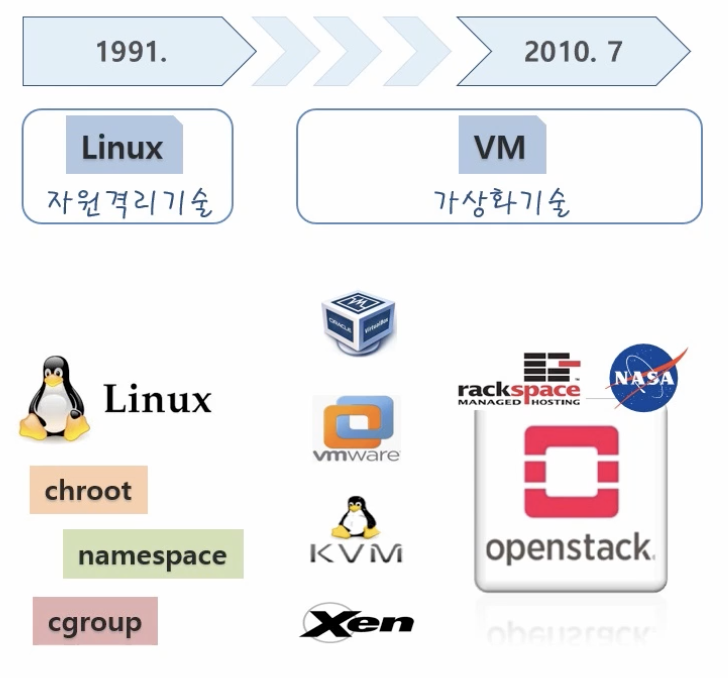

# 대세는 쿠버네티스 ^o^ [초급~중급]

페이지 생성일: 2020-11-15

강의 결제일: 2020-11-15

## 강의소개

### 0. Introduction

큰 기업 → 대규모의 서비스를 운영하고 있기 때문에 최대한 자원을 효율적으로 써야 비용적으로 유리

서버 자원을 효율적으로 쓰기 위해서는 가상화 기술이 필수적

쿠버네티스를 좀 더 잘 이해하려면 가상화 기술들에 대한 히스토리 이해가 필요

- 이때까지 자동화는 되는데 생각보다 시스템 효율이 받춰주지 않음
- 이유: VM을 가상화하기 위해 무거운 OS를 띄워야 함. 가벼운 서비스 하느를 띄우기 위해 이보다 더 큰 OS를 띄워야 하는 경우도 발생

- 컨테이너 가상화 기술은 서비스간 자원을 격리하기 때문에 OS를 올려야하는 부담이 줄어듬
- OS 기동시간이 없기 때문에 자동화 시, 엄청 빠르고 자원 효율도 높게 가져갈 수 있음
- 도커 자체는 하나의 서비스를 컨테이너로 가상화시켜 배포를 하는 프로세스이므로 거대한 서비스들을 운영할 때, 세세하게 배포하고 운영하는 역할을 해주지는 못함
- 컨테이너 오케스트레이터라는 개념 발생

- IT에서는 가장 많이 사용하는 것이 곧 표준

### Kubernetes 초급편에서 다룰 개념들

- 사용자 기능에대한 내용을 중심으로 다룸
- 운영에 대한 내용은 향후 운영편에서 다룰 예정

- 칠해진 부분의 영역을 다룸

## Contents

- 이론과 실습을 나눠서 진행

## [기초편] 기초 다기지

### 1. Why Kubernetes?

- Auto-Scaling

- Auto-Healing

- 배포 상황

운영의 규모가 커질 수록 쿠버네티스의 영향도(효과)가 커짐

운영의 규모가 작은 운영 상황에서도 다양한 방식의 운영에 대해 상세히 계산할 필요가 없어서 유리

### 2. VM vs Container

리눅스 고유 기술

- namespace: 커널 영역 격리
- cgroups: 자원 영역 격리

- 리눅스 위에 윈도우 용 컨테이너를 사용할 수 없음
- 한 컨테이너가 뚫려 OS 영역에 접근 가능하면 다른 컨테이너도 위험할 수 있음

### 3.