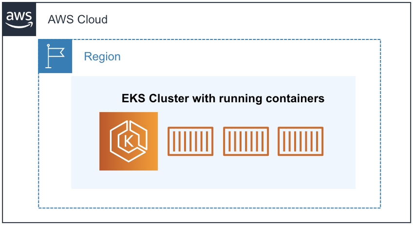

# Amazon EKS로 웹 애플리케이션 구축하기

페이지 생성일: 2020-11-17

### 링크:

[Amazon EKS :: Amazon EKS로 웹 페이지 구성하기](https://master.d3s71i2n51x60t.amplifyapp.com/ko/)

 

# 요건 파악

### 어플리케이션 요건 확인

- 새로운 요청이 있을 때, 변경 사항을 빠르게 반영
- 손쉬운 확장
- 적은 인원으로 운영 및 개발 업무 수행

 

### 요건 반영 결과

- Moder Application 구축
- MSA
- Container
- CI/CD
- Container Orchestration Tool → Kubernetes 선정

모든 것을 오픈 소스로 직접 구축하기에는 업무를 수행할 팀원도 적고 시간도 부족하며, kubernetes를 잘 모르는 인원도 포함되어 있는 상황 → 완전 관리형의 kubernetes 서비스인 Amazon EKS 발견 후 테스트 시도!

 

## Workshop 목표

- 컨테이너 이미지 생성
- Amazon EKS에 컨테이너 배포
- 웹 페이지 올리기

 

## Workshop 진행 순서

- AWS Cloud9을 통한 실습 환경 구축
- 도커를 이용하여 컨테이너 이미지 생성
- 컨테이너 이미지를 ECR에 업로드
- Amazon EKS 클러스터 구축 및 서비스 배포
- 파드 및 클러스터 오토 스케일링
- AWS Fargate로 서비스 올리기 [coming soon]
- CI/CD 파이프라인 구축 [coming soon]

 
 

# Workshop에 필요한 개념

## Kubernetes(k8s) 란?

쿠버네티스는 컨테이너화된 워크로드와 서비스를 관리하기 위한 이식성 있고 확장 가능한 오픈소스 플랫폼

쿠버네티스는 선언적 구성과 자동화를 용이하게 해주는 컨테이너 오케스트레이션 툴

[쿠버네티스란 무엇인가?](https://kubernetes.io/ko/docs/concepts/overview/what-is-kubernetes/)

 

## Kubernetes Cluster

- 쿠버네티스는 클러스터 형식으로 배포
- 클러스터는 노드들의 집합 (노드들은 크게 두 가지 유형으로 분류)
    - 컨트롤 플레인: 워커 노드와 클러스터 내 파드를 관리하고 제어
    - 데이터 플레인: 워커 노드들로 구성되어 있으며 컨테이너화된 애플리케이션의 구성 요소인 파드를 호스트
- Optional 한 애드온 용도의 컴포넌트도 존재

 

## Kubernetes Objects

- 쿠버네티스의 오브젝트는 바라는 상태 (Desired state)를 담은 레코드
- 오브젝트를 생성하면 쿠버네티스의 컨트롤 플레인에서 오브젝트의 현재 상태와 바라는 상태를 일치시키기 위해 끊임없이 관리
- 쿠버네티스의 객체: 파드, 서비스, 디플로이먼트 등

 

## Amazon EKS

### Amazon EKS에 대하여

- Amazon EKS는 Kubernetes를 손쉽게 실행할 수 있는 관리형 서비스
- Amazon EKS를 통해 AWS에서 Kubernetes 컨트롤 플레인 또는 노드를 직접 설치, 운영 및 유지할 필요 X

 

- Amazon EKS는 여러 가용 영역에 Kubernetes 컨트롤 플레인 인스턴스를 실행하여 고가용성을 보장
- 비정상 컨트롤 플레인 인스턴스를 자동으로 감지하고 교체하며, 자동화된 버전 업그레이드 및 패치 제공

 

Amazon EKS는 AWS의 다양한 서비스들과 연동하여 애플리케이션의 확장성 및 보안 제공

- Amazon ECR: 컨테이너 이미지 저장소
- AWS ELB: 부하 분산
- AWS IAM: 인증
- Amazon VPC: 격리된 네트워크

Amazon EKS는 오픈 소스 Kubernetes 소프트웨어의 최신 버전을 실행하므로 Kubernetes 커뮤니티에서 사용되는 플러그인과 도구를 사용 가능 → EKS에서 실행 중인 애플리케이션은 표준 Kubernetes 환경의 앱과 호환

(코드를 수정하지 않고 표준 Kubernetes 애플리케이션을 Amazon EKS로 쉽게 마이그레이션 가능)

 
 

# 워크샵 시작 전 준비 사항